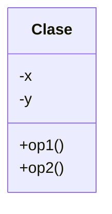

# Ejercicio-Actividad datos estructurados con objetos

## Descripción del Problema

Diseña el diagrama de clases UML que represente la clase ```Fracción``` en C++ de acuerdo a los requerimientos adjuntos.

## Ejemplo de ejecución

```
Arreglo de 5 fracciones
-----------------------
Fraccion 1:
Numerador:
1
Denominador:
2
Fraccion 2:
Numerador:
2
Denominador:
3
Fraccion 3:
Numerador:
3
Denominador:
4
Fraccion 4:
Numerador:
4
Denominador:
5
Fraccion 5:
Numerador:
5
Denominador:
6
Fracciones capturadas:
1/2=0.5
2/3=0.666667
3/4=0.75
4/5=0.8
5/6=0.833333
Sumando la primera y la segunda fracción:
7/6=1.16667
Sumando la tercera y la cuarta fracción:
31/20=1.55
Sumando la quinta y la primera fracción:
4/3=1.33333
```

## Diagrama de Clases


[Diagramas de clase en el lenguaje Mermaid](https://mermaid.js.org/syntax/classDiagram.html)

## Prompt para generar el Diagrama de Clases UML con IA - mermAID

Para generar automáticamente el Diagrama de Clases a partir de los archivos de clases (`.cpp` y `.hpp`) haga lo siguiente:

1. Localice la extensión `mermAID` del lado izquierdo de la barra de herramientas. Dé clic sobre ella.
2. Dé clic sobre el ícono `Continue in Chat` para iniciar una sesión de `mermAId` en el Chat de Copilot.
3. Arrastre los archivos `.cpp` y `.hpp` que desea diagramar del Explorador de Archivos a la caja de diálogo del Chat de Copilot. Este será el contexto de la IA para usar mermAID.
4. Seleccione el modo `Ask` y el modelo `GPT4.1`. Capture el siguiente prompt:

```
@mermaid /uml
```
5. Valida (y corrige si es necesario) el Diagrama de clases UML generado. Después, copia y pega el código `markdown` generado en el espacio correspondiente de este archivo `README.md`.

## Diagrama de clases UML con draw.io

El repositorio está configurado para crear Diagramas de clases UML con ```draw.io```. Para usarlo, sigue estos pasos:

1. Localiza el archivo ```uml.class.drawio.png``` en el explorador de archivos.
2. Da doble clic sobre el archivo ```uml.class.drawio.png``` para abrir el editor ```draw.io``` incrustado en ```VSCode```.
3. Agrega las formas UML necesarias desde el menú de formas del lado izquierdo (selecciona la opción ```+Más formas```).
4. Crea tu diagrama de clases UML utilizando las formas agregadas.
5. Guarda los cambios en el archivo ```uml.class.drawio.png```.
6. Inserta el archivo ```uml.class.drawio.png``` en el apartado de UML de este archivo README.

Para más información consulta el [MarketPlace](https://marketplace.visualstudio.com/items?itemName=hediet.vscode-drawio).

## Revisión de estándares de codificación con IA

1. Abre GitHub Copilot (`Ctrl+Alt+I`).
2. Selecciona el modo `Ask` y el modelo `Auto`.
3. Coloca como contexto el/los `<archivo.cpp/hpp>`(s) a verificar la aplicación de estándares de programación. 
4. Usa cualquiera de los siguientes *prompts*:
```
/rev-std
```
o bien:
```
Revisa la aplicación de cada uno de los estándares de codificación. Si se cumple el estándar indícalo con la frase: "**CUMPLE**". Sí no se cumple algún estandar índicalo con la frase: "**¡NO CUMPLE!**" y muestra para ese estandar un ejemplo de código que sí lo cumple y que sea diferente al revisado con el fin de ilustrar como se puede cumplir. No ofrezcas sugerencias para mi código.
```
4. Verifica los cambios sugeridos y realiza aquéllos que consideres convenientes.
5. Verifica que pasa todas las pruebas.
6. Empuja tu programación a GitHub.

## Aplicación de estándares de codificación con IA

1. Abre GitHub Copilot (`Ctrl+Alt+I`).
2. Coloca como contexto el/los `<archivo.cpp/hpp>`(s) a aplicar los estándares de programación. 
4. Usa el siguiente *prompt*:
```
/app-std
```
4. Verifica los cambios sugeridos y edita/confirma aquéllos que consideres convenientes.
5. Verifica que pasa todas las pruebas y que el programa principal se ejecuta correctamente.
6. Empuja tu programación a GitHub.

## Objetivo

- Busca que el código pase correctamente todas las pruebas
   * Solamente cambia los archivos permitidos para lograr este objetivo (abajo se indican las reglas específicas)
   
- Las GitHub Actions deberán presentar una palomita en verde si se han satisfecho todas las pruebas, y una cruz roja cuando alguna (o todas) las pruebas han fallado.
   * **Recomendación:** Puedes dar clic en la cruz roja para verificar cual de las pruebas ha fallado (o si el código no ha compilado correctamente).
   * **Recomendación:** En caso de que el Autograding no muestre pruebas o no funcione, contacta a tu profesor mediante un issue.

## Instrucciones

- Deberás modificar el archivo `exercise.cpp`  y agregar la programación adicional que sea necesaria.

Explicación de los otros archivos:

- Archivo `test/tests.cpp` tiene las pruebas de esta actividad (NO LO CAMBIES!)
- Archivo `makefile` tienes los comandos para ejecutar la actividad (NO LO CAMBIES!)
- Archivo  `./build/appTests` se generará después de compilar (para **pruebas locales**, solo ejecútalo)

## Comandos para pruebas locales, ejecución y depuración

- Comando para construir y ejecutar pruebas: `make` o `make test` o `make ctest`
    * Si el ejecutable ya está construido, sólo teclea : `./build/appTests`

- Comando para construir y ejecutar la aplicación: `make run` 
    * Si el ejecutable ya está construido, sólo teclea : `./build/exercise`
      
- Comando para depurar: `make debug`
    * Para conocer los comandos de depuración consulta:
     https://u.osu.edu/cstutorials/2018/09/28/how-to-debug-c-program-using-gdb-in-6-simple-steps/

- Comando para depurar con `vsCode`: `make debugvs` 
    * Abre el programa principal.
    * Utiliza el depurador de la IDE.
      
- Comando para depurar pruebas con `vsCode`: `make debugtest` 
    * Abre el programa principal.
    * Utilizar el depurador de la IDE.
- Comando para limpieza de binarios `make clean`
    * Úselo cuando desee eliminar cualquier binario que se haya generado en la carpeta `build`.
    * Úselo cuando detecte que algún binario no está actualizado o bien no se hubiere construido conrrectamente.
- Comando para empujar cambios al Autograding: `make push`
    * Si hay cambios nuevos en la programación, los envía al Autograding. En caso contrario, no los envía (señala que no los hay y no empuja nada).
- Comando para sincronizar cambios entre GitHub y Codespaces: `make pullpush`
    * Si hay cambios en GitHub así como en Codespaces (Flechas de cambios en ambos sentidos) este comando incorpora los cambios de GitHub en Codespaces y luego empuja los cambios de Codespaces a Github.
            
## Instrucciones para construir y ejecutar la aplicación y pruebas usando CMake

1. Entrar al directorio de construcción:
   ```sh
   cd build
   ```

2. Configurar el proyecto con CMake:
   ```sh
   cmake -DTEST_EXECUTABLE=ON ..
   cmake -DMAIN_EXECUTABLE=ON ..
   ```

3. Construir la aplicación:
   ```sh
   cmake --build .
   ```

4. Ejecutar la aplicación:
   ```sh
   ./exercise
   cd ..
   ```
5. Ejecutar las pruebas:
   ```sh
   ./appTests
   cd ..
   ```
## Notas

- El código será evaluado solamente si compila.
   * La razón de esto es, si no compila no es posible generar el ejecutable y realizar las pruebas.

- Algunos casos de prueba podrían recibir calificación individual, otros podrían recibir calificación y si pasan todos juntos (o todas las pruebas en conjunto).

- La calificación final se otorgará de manera automática en cada *commit*, y se evaluará solamente hasta la fecha limite de la actividad.
